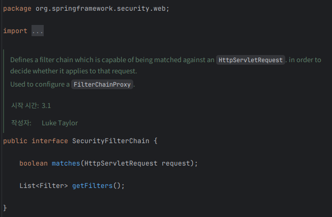
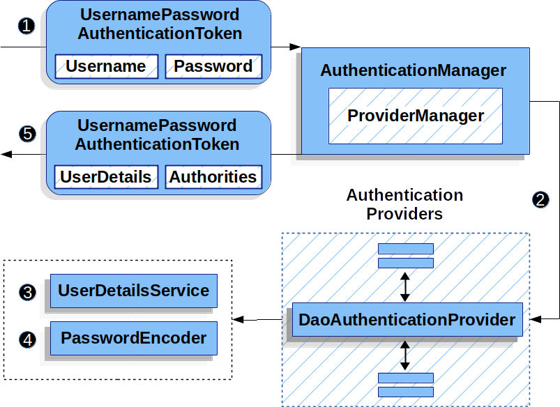

# 스프링 시큐리티는 로컬 로그인을 어떤 식으로 처리할까?

> “우리는 로그인/로그아웃/회원가입을 이렇게 구현할 수 있을까?” 

로컬 로그인 구현을 하다 보면 이런 순간이 옵니다.

* “내가 만든 `LocalLoginSuccessHandler`가 로그인 ‘자체’를 하는 건가?”
* “로그인 API(`/api/v1/auth/login`)를 컨트롤러로 꼭 만들어야 하나?”
* “세션은 누가 만들고, 인증 정보는 어디에 저장되는 거지?”

결론부터 말하면, **스프링 시큐리티가 인증의 뼈대(필터 체인/인증 매니저/인증 상태 저장/로그아웃)를 전부 책임지고**, 우리는 그 위에 **서비스 요구사항(잠금 정책, 디바이스 차단, 감사 로그, 세션 매핑, JWT denylist 등)을 ‘후처리로 붙이는’ 방식**으로 구현합니다.

이 글은 **로컬 로그인(세션 기반) + JWT 기반(API)** 관점에서 스프링 시큐리티 내부 구조를 따라가며 정리합니다.

---

## 0) 큰 그림: 스프링 시큐리티 영역 vs 사용자 서비스 영역

### A. 스프링 시큐리티 영역(프레임워크가 주도하는 인증 파이프라인)

1. 요청이 들어오면 **SecurityFilterChain**으로 진입

2. 로그인 요청이면 **(로그인용 Filter)** 가 자격증명을 추출

    * 예: `UsernamePasswordAuthenticationFilter`가 **아이디/비밀번호를 추출**하고
      `UsernamePasswordAuthenticationToken(unauthenticated)` 생성

3. Filter는 인증을 직접 하지 않고 **AuthenticationManager**에게 위임

4. AuthenticationManager는 **AuthenticationProvider**를 골라 인증 처리 흐름을 진행

    * 어떤 Provider를 쓸지 선택/위임하는 흐름 자체는 시큐리티 영역

5. 성공하면 **SecurityContext**를 만들고
   **SecurityContextRepository**가 저장(세션 기반이면 세션에 저장)

6. 로그아웃은 **LogoutFilter**가 잡고
   **LogoutHandler**들이 시큐리티 컨텍스트/세션 정리 등의 흐름을 수행

> 위 구간은 “시큐리티가 제공하는 인증/로그아웃 파이프라인”이며,
> 애플리케이션은 주로 설정/확장 지점에 끼워 넣는 형태로 참여합니다.

 

### B. 사용자 서비스 영역(애플리케이션이 책임지는 ‘정책/데이터’)

5. **아이디(Username) 검증(사용자 조회/계정 상태 판단의 근거 제공)**

    * 시큐리티가 `UserDetailsService.loadUserByUsername(username)`을 호출하지만
    * 실제로는 애플리케이션이 DB/외부 시스템에서 **사용자 조회 로직**을 구현합니다.
    * “존재 여부/권한/상태(locked, disabled…)의 근거 데이터”는 서비스가 제공

6. **비밀번호(Password) 검증의 ‘재료’와 ‘정책’**

    * 비교 자체(`PasswordEncoder.matches`)는 시큐리티 흐름 안에서 일어나지만,
    * 어떤 인코더를 쓰는지(BCrypt/Argon2 등), 해시 저장 규칙, 마이그레이션 정책은 보통 서비스/설정 책임
    * 즉, **검증 동작은 시큐리티가 수행**하되 **정책/구현체 선택은 애플리케이션 책임**인 경우가 많습니다.

7. **SuccessHandler / FailureHandler 후처리(업무 로직)**

    * 로그인 성공: 마지막 로그인 시간 갱신, 접속 이력 저장, JWT 발급, 추가 프로필 체크 등
    * 로그인 실패: 실패 횟수 증가, 계정 잠금, 알림 발송 등
    * 이건 전형적인 **사용자 서비스(업무 요구사항) 영역**입니다.

 

### 한 줄 요약(경계 감각)

* **시큐리티 영역(뼈대/흐름):** `Filter → Manager → Provider → SecurityContext 저장 → (Handler 호출)`
* **서비스 영역(내용/정책/데이터):** 사용자 조회/상태 데이터 제공, 비밀번호 정책(인코더 선택), 성공/실패 후처리(기록·락·알림)

---

## 1) Set up: 애플리케이션 시작 시 준비되는 핵심 컴포넌트들

### 1-1. SecurityFilterChain(들)

프로젝트에서는 보통 체인이 2개로 나뉩니다.

* **API 체인(`/api/**`)**: JWT 검증, 세션 생성 안 함(STATELESS)
* **웹/세션 체인**: 세션 기반 인증 유지, 로그인 성공 시 SecurityContext를 세션에 저장

여기서 중요한 건, “컨트롤러보다 필터가 먼저 돈다”는 사실입니다.
그래서 로그인도 컨트롤러가 아니라, **필터가 요청을 가로채 인증을 시작**할 수 있습니다.

 

### 1-2. AuthenticationManager + AuthenticationProvider

* Filter는 인증을 하지 않습니다.
* Filter는 `AuthenticationManager.authenticate(...)`만 호출합니다.
* `AuthenticationManager(ProviderManager)`는 **적절한 Provider**에게 위임합니다.

 

로컬 로그인에서는 보통 `DaoAuthenticationProvider`가 선택되고,

* `UserDetailsService`로 DB에서 유저를 읽고
* `PasswordEncoder`로 비밀번호를 검증합니다.

이 구조가 “왜 좋은가”를 한 줄로 정리하면:

> 인증 검증(비밀번호 비교) 같은 핵심은 프레임워크가 책임지고, 우리는 정책과 후처리를 붙일 수 있다.

 

### 1-3. SecurityContextRepository

“로그인이 유지되는 이유”는 이 컴포넌트 하나로 설명됩니다.

* 인증 성공 → SecurityContext 생성 → 저장
* 세션 기반이면 “세션 저장소(Spring Session 포함)”에 저장
* 다음 요청에서 SecurityContext를 다시 꺼내 인증된 사용자로 처리

여기서 한 번 느꼈던 함정은 이거였습니다.
“세션이 있는데도 인증이 풀리는” 경우는 대부분 **SecurityContext 저장/로드가 기대대로 안 되는 경우**였고, 그 원인을 FilterChain 설정에서 찾게 되더라고요.

---

## 2) 로컬 로그인 요청 처리: 어디서 로그인 ‘입력’을 읽고, 어디서 ‘검증’할까?

### 2-1. 입력 추출은 Filter가 한다 (JSON이면 커스텀 Filter)

로컬 로그인에서 자주 쓰는 패턴이 두 가지입니다.

* **기본 폼 로그인**: `UsernamePasswordAuthenticationFilter`가 파라미터에서 id/pw 읽음
* **JSON 로그인(API 서버)**: 커스텀 필터(예: `LocalJsonLoginFilter`)가 JSON 바디에서 id/pw 읽음

즉, “우리는 왜 LocalJsonLoginFilter를 만들었나?”의 답은 간단합니다.
**입력이 폼이 아니라 JSON이기 때문**입니다.

그리고 중요한 포인트 하나: 이메일 정규화 (`trim()` + `lowercase()`)

이걸 초입에서 확정해두면,

* DB 유니크 정책
* 로그인 시도 로그
* 잠금 정책 키
  같은 것들이 전부 안정적으로 맞물립니다.

 

### 2-2. 검증은 Provider가 한다 (DaoAuthenticationProvider)

검증 로직은 Filter가 아니라 Provider가 합니다.

* UserDetailsService로 사용자 조회
* PasswordEncoder로 hash 비교

 

### 2-3. 인증 유지의 핵심은 SecurityContext 저장

인증 성공 시점에서 끝이 아니라, “저장”이 끝입니다.

* 성공 Authentication → SecurityContextHolder에 세팅
* SecurityContextRepository가 저장

이게 잘 되면 컨트롤러 없이도 “로그인 결과(세션 발급)”가 성립합니다.
반대로 여기서 삐끗하면, 아무리 성공 핸들러가 잘 돌아도 다음 요청에서 인증이 풀립니다.

---

## 3) LocalLoginSuccessHandler: “성공 이후 해야 할 일”을 모으는 곳

프로젝트에서 성공 후처리로 처리하고 싶은 요구사항은 보통 이런 것들입니다.

* 실패 카운트/잠금 초기화
* 디바이스 차단 검사(차단이면 즉시 무효화)
* 로그인 감사 로그 기록(LoginAttempt)
* 디바이스 정보 upsert(UserDevice)
* 세션-유저-디바이스 매핑 저장(UserSessionMap)
* JSON 응답 바디(DTO) 반환

여기서 핵심은:   
**이 일들은 ‘인증’이 아니라 ‘도메인 정책/운영 기능’** 이라는 겁니다.
그래서 `AuthenticationSuccessHandler`에 모으는 게 자연스럽습니다.

---

## 4) 실패/잠금 정책: 인증 실패는 Provider가 던지고, 정책은 서비스가 결정한다

실패 처리도 골격이 같습니다.

* Provider가 예외를 던짐
* FailureHandler(또는 예외 흐름)에서

    * 실패 로그 기록(LoginAttemptService.record)
    * 실패 횟수 증가/잠금 시간 갱신(LocalLoginPolicyService, LocalCredentialEntity)

이걸 분리하면 좋은 점:

* 잠금 정책을 바꾸기가 쉽다(5분 → 10분, 5회 → 3회 등)
* 인증 모듈이 복잡해지지 않는다
* 테스트가 분리된다(정책 테스트 vs 인증 테스트)

---

## 5) 로그아웃: 로그인과 달리 “컨트롤러가 없어도 되는 대표 기능”

### 5-1. 세션 기반 로그아웃은 LogoutFilter가 처리한다

스프링 시큐리티는 로그아웃도 필터가 처리합니다.

* `http.logout { logoutUrl(...) ... }` 만 설정하면
* 해당 URL 요청은 **LogoutFilter**가 잡고
* 등록된 **LogoutHandler**들을 호출한 뒤 응답을 마무리합니다.

따라서 **세션 기반 로그아웃은 컨트롤러를 만들 필요가 없습니다.**
프로젝트에서 만든 `DbSessionRevokeLogoutHandler`는 여기서 호출되는 후처리 핸들러 역할입니다.

여기서 중요한 포인트:

* Spring Session row 삭제만 하면 운영 기록이 남지 않습니다.
* 그래서 `user_session_map` 같은 테이블에 revoke(시간/사유)를 남기고,
* 동시에 Spring Session 저장소에서도 삭제하는 형태가 더 운영 친화적입니다.

 

### 5-2. JWT 기반 로그아웃은 “denylist 등록”이라 컨트롤러가 있는 편이 자연스럽다

JWT는 Stateless라서 “세션 삭제”로 로그아웃이 안 됩니다.
보통은 `/api/v1/auth/jwt/logout` 같은 엔드포인트에서 **현재 토큰을 denylist에 등록**합니다.

이 부분은 컨트롤러/서비스로 두는 편이 자연스럽습니다.
(필터로도 가능하지만, 운영/명시성 면에서 컨트롤러가 읽기 쉽습니다.)

---

## 6) 회원가입: 인증 파이프라인이 아니라 “계정 생성”이라 서비스로 처리한다

회원가입은 “필터 체인에서 인증”할 대상이 아니라,

* 이메일 중복 검사
* 비밀번호 해싱 저장
* 유저 엔티티 생성
  같은 도메인 로직입니다.

그래서 보통:

* 회원가입 API는 permitAll
* LocalAuthService.signUp 같은 서비스에서 처리
* 검증은 DTO(형식) + 도메인(중복/정지 상태 등)로 이중화
  가 됩니다.

---

## 7) “로그인 API를 별도로 구현하지 않아도 되는 것” 정리

여기가 핵심 질문 포인트라, 케이스별로 정확히 정리합니다.

### ✅ 케이스 A: 기본 폼 로그인(`formLogin`)을 쓰는 경우

* 스프링 시큐리티 기본 로그인 처리(UsernamePasswordAuthenticationFilter)가 동작
* **로그인 컨트롤러/API를 만들 필요가 없습니다.**
* 로그인 페이지/파라미터 이름만 설정하면 됩니다.

 

### ✅ 케이스 B: JSON 로그인(현재 프로젝트 스타일)인 경우

* `LocalJsonLoginFilter`가 `/api/v1/auth/login`을 가로채서 인증 수행
* 이 경우에도 원칙적으로 **로그인 컨트롤러는 필요 없습니다.**
* 즉, 로그인은 “필터 엔드포인트”로 구현됩니다.

> 만약 현재 `LocalAuthController.login()`이 존재한다면, 구조적으로는 “컨트롤러가 인증을 하는 것처럼 보이게 만들” 가능성이 있습니다.
> 스프링 시큐리티 체인에서 필터가 로그인 URL을 처리하도록 정리하면, 컨트롤러 없이도 로그인 결과(JSON 응답 포함)를 만들 수 있습니다(성공 핸들러에서 응답 작성).

 

### ✅ 케이스 C: 로그아웃(세션 기반)

* `http.logout { ... }` 설정만으로 로그아웃 가능
* **로그아웃 컨트롤러는 필요 없습니다.**
* 후처리는 LogoutHandler로 붙이면 됩니다.

 

### ✅ 케이스 D: 로그아웃(JWT 기반)

* denylist 등록이 필요하면 보통 컨트롤러가 필요합니다.
* 다만 “토큰 버전 전략(tokenVersion)” 같은 방식이면, denylist 없이도 가능(대신 DB 조회가 늘어남).

---
